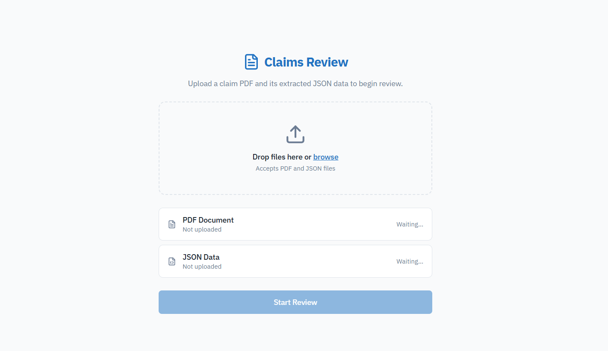
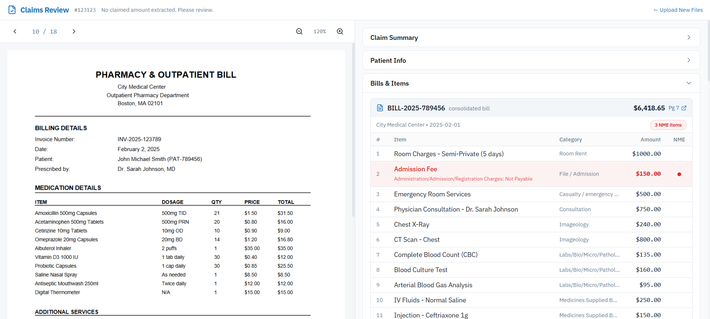

# 🏥 Medical Claim Review Dashboard

A modern dashboard to review and compare medical claims efficiently. This dashboard displays structured claim JSON data alongside the corresponding medical PDF document to help reviewers verify and validate claims quickly.

This project simulates a real-world insurance claim review system used by healthcare providers and insurance companies.

---

## 🚀 Features

- 📄 View medical claim PDF document inside dashboard
- 📊 Display structured claim JSON data
- 🔍 Side-by-side comparison of claim data and PDF
- 📤 Upload your own PDF and JSON files
- ⚡ Fast and responsive user interface
- 🎨 Clean and modern dashboard design
- 📱 Responsive layout for different screen sizes
- 🧩 Modular and scalable component structure
- 🖥️ Sidebar navigation

---

## 🖼️ Screenshots

### Dashboard Overview


### Claim Data Panel


### Medical PDF Viewer


---

## 🛠️ Tech Stack

### Frontend
- React
- TypeScript
- Tailwind CSS
- ShadCN UI

### Data Source
- JSON file
- PDF document

---

## 📂 Demo Files

This project includes demo files stored in the **public folder** for demonstration purposes:

- 📄 Demo PDF → `/demo-claim.pdf`
- 📊 Demo JSON → `/demo-data.json`

These files load automatically when the dashboard opens, allowing users to immediately see how the claim review system works.

Users can also upload their own PDF and JSON files to review custom claims.

---

## ⚙️ Installation & Setup

### 1. Clone the repository

```bash
git clone https://github.com/rajeevroy21/Medical-Claim-Review-Dashboard-App.git
