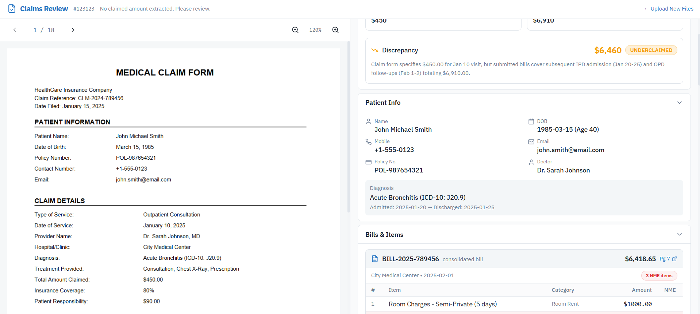

# 🏥 Medical Claim Review Dashboard

A modern dashboard to review and compare medical claims efficiently. This dashboard displays structured claim JSON data alongside the corresponding medical PDF document to help reviewers verify and validate claims quickly.

This project simulates a real-world insurance claim review system used by healthcare providers and insurance companies.

---

## 🚀 Features

- 📄 View medical claim PDF document inside dashboard
- 📊 Display structured claim JSON data
- 🔍 Side-by-side comparison of claim data and PDF
- ⚡ Fast and responsive user interface
- 🎨 Clean and modern dashboard design
- 📱 Responsive layout for different screen sizes
- 🧩 Modular and scalable component structure
- 🖥️ Sidebar navigation

---

## 🖼️ Screenshots

### Dashboard Overview


### Claim Data Panel


### Medical PDF Viewer


---

## 🛠️ Tech Stack

### Frontend
- Next.js 14 (App Router)
- React
- TypeScript
- Tailwind CSS
- ShadCN UI

### Data Source
- JSON file
- PDF document

---

## ⚙️ Installation & Setup

### 1. Clone the repository

```bash
git clone https://github.com/rajeevroy21/Medical-Claim-Review-Dashboard-App.git
